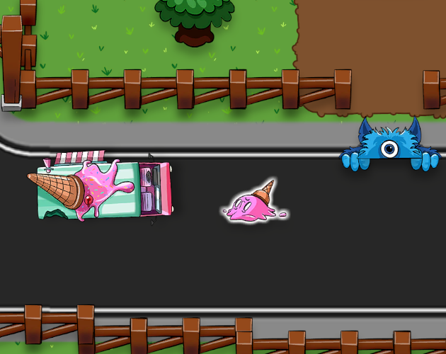

# Gamedev.tv Complete Unity 2D Developer Course

This repository contains games and prototypes from "Complete Unity 2D Developer: Design & Develop Games in Unity 6 using C#" course made by Gamedev.tv

_Made and Tested with **Unity 6000.1.8f1**_

## Screenshots

*Delivery Dash Game*

---

*Snow Surfer Game*

---